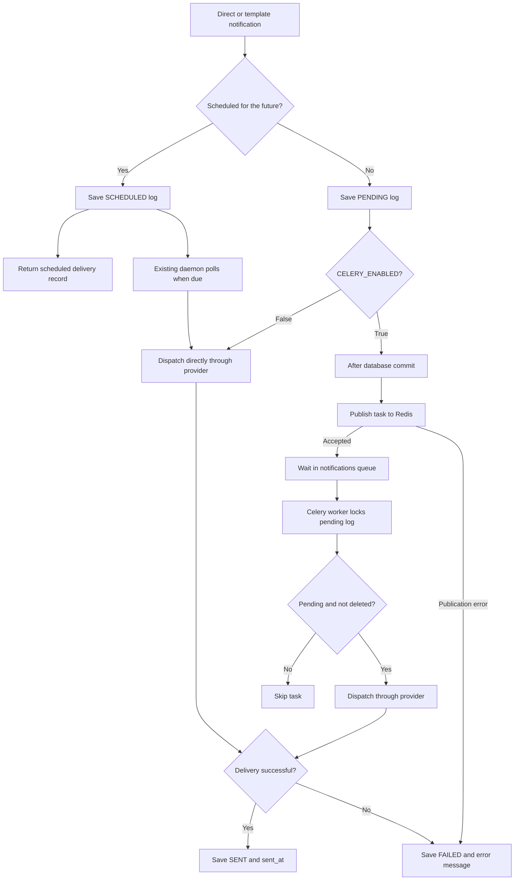
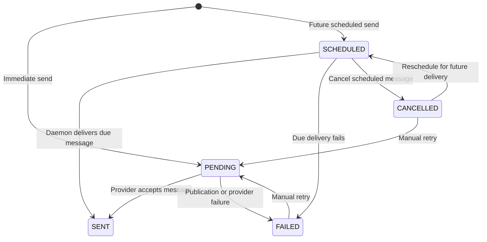

# Multi-Channel Notifications & Scheduling (`apps.notifications`)

Business routes require an explicit IAM grant for regular users and staff. Existing ownership and organization access rules also apply. See [module permission actions and rollout](../iam/README.md#module-route-permissions) for grants and public/self-service exceptions.

The `apps.notifications` package provides Email and Telegram delivery, reusable
templates, scheduled messages, manual retries, and delivery logs. Immediate
messages can use an optional Redis broker and Celery worker to perform provider
I/O outside API requests.

---

## Architecture & Providers

### Provider Registry (`apps.notifications.providers`)
- **`BaseNotificationProvider`**: Abstract interface for notification dispatchers (`send(recipient, subject, body, **kwargs)`).
- **`EmailProvider`**: Multipart HTML + plaintext fallback with `django.core.mail` and local `smtp4dev` integration.
- **`TelegramProvider`**: Direct dispatch via Telegram Bot API with Markdown/HTML formatting.
- **`ProviderRegistry`**: Dynamic registration of custom providers (e.g. SMS, Slack, WebPush).

### Notification Templates (`NotificationTemplate`)
- Reusable templates supporting Django template interpolation (`{{ username }}`, `{{ amount }}`).
- Multi-channel content variants.

### Scheduled Notifications Engine
- Support for delayed or scheduled delivery (`scheduled_for`).
- Lifecycle management: `/cancel/`, `/reschedule/`, `/retry/`.
- **Concurrency-safe background worker** with `select_for_update(skip_locked=True)`.

---

## Background Notification Worker

### Optional Celery delivery for immediate notifications

Install the optional dependencies:

```bash
uv sync --extra celery
```

Set these values in `.env` for both the API and worker:

```dotenv
CELERY_ENABLED=True
REDIS_URL=redis://localhost:6379/0
# CELERY_BROKER_URL can override REDIS_URL.
```

Start Redis (for example, using Docker), then run the worker and API in separate terminals:

```bash
docker run --rm --name djancore-redis -p 127.0.0.1:6379:6379 redis:7-alpine
uv run --extra celery celery -A config.celery:app worker --loglevel=info --queues=notifications --pool=solo
uv run --extra celery python manage.py runserver
```

In production, set `DJANGO_SETTINGS_MODULE=config.settings.production` for the
worker and API, and configure Redis persistence and access controls. Use
PostgreSQL for concurrent delivery workers; SQLite does not provide row locks.

The local command uses `--pool=solo` to process tasks in the worker's main
process. This avoids child-process initialization failures on macOS with a
spawn-based multiprocessing setup, including `fast_trace_task` errors such as
`ValueError: not enough values to unpack (expected 3, got 0)`. Stop the existing
worker before restarting with this option. Linux deployments can use the default
`prefork` pool for process concurrency. See [Celery pool options](https://docs.celeryq.dev/en/stable/userguide/concurrency/index.html).

If a task failed before reaching notification delivery, its log can remain
`PENDING` and the task may already have been consumed. Restarting the worker does
not guarantee that task is replayed. Send a new test request after correcting
the pool; inspect existing pending logs before attempting recovery.

For local smtp4dev delivery, configure `.env` for both the API and worker:

```dotenv
EMAIL_BACKEND=django.core.mail.backends.smtp.EmailBackend
EMAIL_HOST=localhost
EMAIL_PORT=2525
EMAIL_USE_TLS=False
EMAIL_USE_SSL=False
```

Restart both processes after changing `.env`. Development defaults to console
output only when no email backend is configured. SystemConfig entries override
the corresponding environment settings; check them if the effective backend or
SMTP destination differs. If the worker runs in a container, use the smtp4dev
service hostname and its internal SMTP port instead of the host-mapped address.

With `CELERY_ENABLED=True`, immediate direct and template sends normally return
HTTP 201 with a `PENDING` notification log. Publication happens after the database commit.
The worker performs Email or Telegram delivery and updates the log to `SENT` or
`FAILED`. Inspect `GET /api/v1/notifications/logs/{id}/` for the result. Manual
retries also use the queue. A successful API response means a delivery record
was created, not that the message was delivered.

If publication fails, the log becomes `FAILED`; it can be retried once Redis is
available. There is no synchronous delivery fallback while queue mode is enabled.
Provider failures are recorded for manual retry; automatic retries and recovery
of tasks lost during a worker crash are outside this feature. A database lock
prevents concurrent tasks from sending the same pending log on PostgreSQL, but
delivery is not exactly once: a crash after provider acceptance and before the
database commit can leave delivery uncertain. Inspect the provider before retrying.

Provider options passed through the Python service must be JSON serializable.
Credentials should come from worker settings or SystemConfig rather than task
arguments. No Celery result backend is needed: delivery results live in
`NotificationLog`.

`CELERY_ENABLED=False` (the default) keeps synchronous immediate delivery and
does not require Celery or Redis. Future scheduled messages retain the existing
database scheduler below; they are not queued by this feature.

Run background delivery tests with:

```bash
uv run --extra celery python manage.py test apps.notifications --settings=config.settings.test
```

### Scheduled notification worker

Run the worker daemon or cron task:

```bash
# Single execution run
uv run python manage.py process_scheduled_notifications

# Continuous background daemon (polls every 10 seconds)
uv run python manage.py process_scheduled_notifications --daemon --interval 10
```

---

## Delivery Process and Flow Diagrams

### Components

| Component | Responsibility |
|---|---|
| Django API / `NotificationService` | Validate requests, render templates, create delivery logs, and publish immediate tasks after commit |
| Database / `NotificationLog` | Store recipients, rendered content, context, status, delivery time, and errors |
| Redis | Hold Celery task messages in the `notifications` queue |
| Celery / `deliver_notification` | Load and lock a pending log, call its provider, and save the delivery result |
| Email / Telegram provider | Read configuration from worker settings or SystemConfig and contact SMTP / Telegram |
| Scheduled notification daemon | Poll due scheduled logs and deliver them directly using the existing providers |

Redis carries the notification ID and any JSON-serializable provider options.
The message content and delivery result stay in the database. Redis does not
send messages itself; the Celery worker must be running to consume tasks.

### Immediate delivery with Redis and Celery

1. The API validates a direct or template request. Template requests render the
   subject and body before creating the log.
2. `NotificationService.send()` creates a `PENDING` log and registers a
   `transaction.on_commit()` callback. A transaction rollback discards both the
   record and callback. In autocommit mode, the callback runs immediately.
3. The callback publishes `deliver_notification(log_id, **kwargs)` to Redis.
   The API still performs database and broker I/O, but does not wait for SMTP or
   Telegram delivery. HTTP 201 acknowledges creation of the delivery record.
4. A Celery worker opens a database transaction, locks the row, and checks that
   it is still `PENDING` and not soft deleted. Missing or already handled logs
   are skipped.
5. The worker dispatches through the registered channel provider. It saves
   `SENT` with `sent_at` on success, or `FAILED` with `error_message` on failure,
   then commits the result.
6. The client reads the delivery log endpoint to obtain the current result.

```mermaid
sequenceDiagram
    participant Client
    participant API as Django API / Service
    participant DB as Database
    participant Redis as Redis notifications queue
    participant Worker as Celery worker
    participant Provider as Email / Telegram

    Client->>API: POST send or send-template
    API->>DB: Create PENDING log
    API->>API: Register on_commit callback
    Note over API,DB: Publish only after commit; rollback discards callback
    API->>Redis: Publish task with notification ID
    API-->>Client: HTTP 201 with log ID and status snapshot
    Note over Client,Worker: Worker execution is independent of response timing
    Worker->>Redis: Consume task
    Worker->>DB: Lock and load PENDING log
    alt Log is pending and available
        Worker->>Provider: Send stored message
        Provider-->>Worker: Success or failure
        Worker->>DB: Commit SENT or FAILED
    else Log is missing, deleted, or no longer pending
        Worker->>Worker: Skip delivery
    end
    Client->>API: GET delivery log
    API->>DB: Read current status
    API-->>Client: Delivery status and error details
```

The response contains a status snapshot; the worker can finish before the
client receives it. If publication fails before response serialization, the
response can already contain `FAILED`. If publication happens after an enclosing
transaction commits, the client should fetch the log to see that failure.

### Choosing the delivery path



The scheduled daemon continues to dispatch directly even when Celery is enabled.
Celery Beat is not needed for this implementation. When Celery is disabled,
immediate API requests wait for provider delivery and return its result.

### Status lifecycle and manual retries



| Status | Meaning |
|---|---|
| `PENDING` | An immediate delivery record exists; in queue mode it awaits or is undergoing worker delivery |
| `SCHEDULED` | The message awaits its future delivery time in the database scheduler |
| `SENT` | The provider reported success; this does not prove the recipient read the message |
| `FAILED` | Publication or provider delivery failed; inspect `error_message` |
| `CANCELLED` | A scheduled message was cancelled before delivery |

`POST /api/v1/notifications/logs/{id}/retry/` accepts only `FAILED` or
`CANCELLED` logs. It clears the previous error and delivery timestamp, sets the
log to `PENDING`, then uses the configured immediate delivery path. A cancelled
scheduled message retried this way is sent immediately rather than waiting for
its previous scheduled time. To deliver it later, use the reschedule endpoint.

Automatic retries are not enabled. A broker outage records a publication failure;
an unavailable worker leaves accepted tasks waiting in Redis. Worker crashes can
leave a log pending or its delivery uncertain, so this implementation does not
provide automatic crash recovery or exactly-once delivery.

---

## Python Dispatch Usage

```python
from datetime import timedelta

from django.utils import timezone

from apps.notifications.services import NotificationService

# Immediate send: queued when CELERY_ENABLED=True, otherwise synchronous.
NotificationService.send(
    channel="email",
    recipient="customer@example.com",
    subject="Welcome to Djancore",
    body="Your account is now ready.",
    user=user,
)

# Template dispatch with scheduling
NotificationService.send_template(
    template_code="WELCOME_EMAIL",
    recipient="customer@example.com",
    context={"username": "Alice", "plan": "Pro"},
    scheduled_for=timezone.now() + timedelta(hours=1),
)
```

---

## API Endpoints (`/api/v1/notifications/`)

| Method | Endpoint | Description |
|---|---|---|
| `POST` | `/api/v1/notifications/send/` | Create direct or scheduled notification; immediate delivery is queued when Celery is enabled |
| `POST` | `/api/v1/notifications/send-template/` | Render template and create notification using the configured delivery path |
| `GET` | `/api/v1/notifications/providers/` | List available channel providers & status |
| `GET/POST` | `/api/v1/notifications/templates/` | Manage notification templates (IAM grant) |
| `GET/PUT/PATCH/DEL` | `/api/v1/notifications/templates/{id}/` | Notification template details & soft-delete |
| `GET` | `/api/v1/notifications/logs/` | List delivery logs (users see theirs, staff sees all) |
| `GET` | `/api/v1/notifications/logs/{id}/` | Inspect delivery attempt & error diagnostics |
| `POST` | `/api/v1/notifications/logs/{id}/cancel/` | Cancel pending scheduled notification |
| `POST` | `/api/v1/notifications/logs/{id}/reschedule/` | Reschedule pending notification |
| `POST` | `/api/v1/notifications/logs/{id}/retry/` | Retry failed/cancelled notification |
