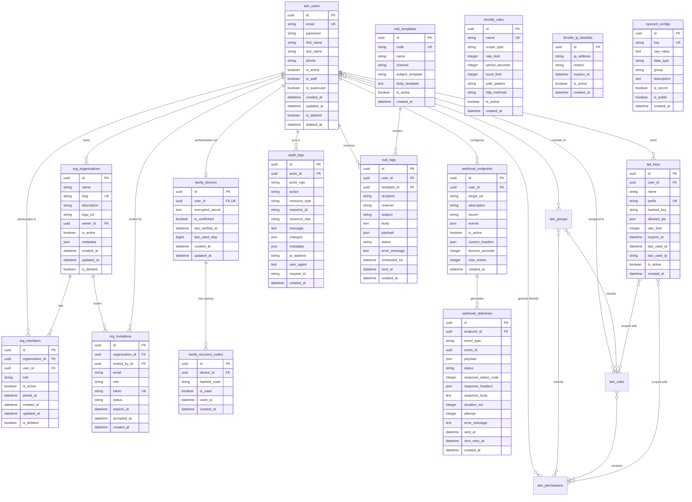

# Database Design & Architecture

Comprehensive database schema documentation and Entity Relationship Diagram (ERD) for **djancore**.

---

## 📑 Table of Contents

- [Architectural Principles](#-architectural-principles)
- [Table Naming Conventions](#-table-naming-conventions)
- [Entity Relationship Diagram (ERD)](#-entity-relationship-diagram-erd)
- [Domain Table Schemas](#-domain-table-schemas)
  - [1. Identity & Access Management (IAM)](#1-identity--access-management-iam)
  - [2. Two-Factor Authentication (2FA)](#2-two-factor-authentication-2fa)
  - [3. Multi-Tenancy & Organizations](#3-multi-tenancy--organizations)
  - [4. Developer API Keys](#4-developer-api-keys)
  - [5. Throttling & Abuse Prevention](#5-throttling--abuse-prevention)
  - [6. Outbound Webhooks](#6-outbound-webhooks)
  - [7. Immutable Audit Trails](#7-immutable-audit-trails)
  - [8. Multi-Channel Notifications](#8-multi-channel-notifications)
  - [9. Dynamic System Configuration](#9-dynamic-system-configuration)
- [Indexing & Performance Strategy](#-indexing--performance-strategy)
- [Security & Encryption at Rest](#-security--encryption-at-rest)

---

## 🏛️ Architectural Principles

1. **UUIDv4 Primary Keys**: All domain models inherit from `UUIDModel` (`uuid_generate_v4()`), preventing sequential ID enumeration attacks.
2. **Universal Timestamps**: Every table tracks microsecond-precision `created_at` and `updated_at` timestamps.
3. **Soft Delete Pattern**: Critical models inherit from `SoftDeleteModel` (`is_deleted`, `deleted_at`), protecting against accidental data loss while allowing administrative restoration.
4. **Append-Only Immutability**: Compliance-sensitive logs (`audit_logs`, `webhook_deliveries`, `noti_logs`) prohibit SQL `UPDATE` and `DELETE` queries at both application and queryset levels.
5. **Encryption at Rest**: Sensitive credentials (TOTP seeds, webhook secrets, secret system configs) are encrypted using AES-128 Fernet before database writes.

---

## 🏷️ Table Naming Conventions

All database tables follow concise domain-prefixed plural naming:

| App Domain | Table Prefix | Tables |
|---|---|---|
| Identity & Access | `iam_*` | `iam_users`, `iam_roles`, `iam_permissions`, `iam_groups` |
| Two-Factor Auth | `twofa_*` | `twofa_devices`, `twofa_recovery_codes` |
| Organizations | `org_*` | `org_organizations`, `org_members`, `org_invitations` |
| Developer API Keys | `api_keys` | `api_keys` |
| Throttling & Defense | `throttle_*` | `throttle_rules`, `throttle_ip_blocklist` |
| Outbound Webhooks | `webhook_*` | `webhook_endpoints`, `webhook_deliveries` |
| Compliance Audit | `audit_logs` | `audit_logs` |
| Notifications | `noti_*` | `noti_templates`, `noti_logs` |
| System Config | `sysconf_*` | `sysconf_configs` |

---

## 📊 Entity Relationship Diagram (ERD)

---

## 🗄️ Domain Table Schemas

### 1. Identity & Access Management (IAM)

#### Table: `iam_users`
Custom User model with email as the unique login credential and soft delete.

| Column | Type | Constraints | Default | Description |
|---|---|---|---|---|
| `id` | `UUID` | `PRIMARY KEY` | `gen_random_uuid()` | Unique user identifier. |
| `email` | `VARCHAR(254)` | `UNIQUE`, `NOT NULL`, `INDEX` | — | User email address. |
| `password` | `VARCHAR(128)` | `NOT NULL` | — | Argon2 / PBKDF2 hashed password string. |
| `first_name` | `VARCHAR(150)` | `NOT NULL` | `""` | User given name. |
| `last_name` | `VARCHAR(150)` | `NOT NULL` | `""` | User family name. |
| `phone` | `VARCHAR(20)` | `NOT NULL` | `""` | Optional phone number. |
| `is_active` | `BOOLEAN` | `NOT NULL`, `INDEX` | `TRUE` | Whether user can log in. |
| `is_staff` | `BOOLEAN` | `NOT NULL` | `FALSE` | Access to admin console. |
| `is_superuser` | `BOOLEAN` | `NOT NULL` | `FALSE` | Unrestricted superuser authority. |
| `last_login` | `TIMESTAMPTZ` | `NULL` | `NULL` | Timestamp of last authentication. |
| `date_joined` | `TIMESTAMPTZ` | `NOT NULL` | `NOW()` | Account creation timestamp. |
| `is_deleted` | `BOOLEAN` | `NOT NULL`, `INDEX` | `FALSE` | Soft delete flag. |
| `deleted_at` | `TIMESTAMPTZ` | `NULL` | `NULL` | Soft delete execution timestamp. |
| `created_at` | `TIMESTAMPTZ` | `NOT NULL`, `INDEX` | `NOW()` | Record insertion timestamp. |
| `updated_at` | `TIMESTAMPTZ` | `NOT NULL` | `NOW()` | Record last modification timestamp. |

#### Table: `iam_permissions`
Granular declarative permission definitions (`Action`, `Resource`, `Effect`).

| Column | Type | Constraints | Default | Description |
|---|---|---|---|---|
| `id` | `UUID` | `PRIMARY KEY` | `gen_random_uuid()` | Permission unique ID. |
| `name` | `VARCHAR(150)` | `UNIQUE`, `NOT NULL` | — | Human-friendly permission name. |
| `action` | `VARCHAR(150)` | `NOT NULL`, `INDEX` | — | Action pattern (e.g. `users:read`, `iam:*`, `*`). |
| `resource` | `VARCHAR(255)` | `NOT NULL`, `INDEX` | `"*"` | Resource ARN/pattern (e.g. `*`, `org:123:*`). |
| `effect` | `VARCHAR(10)` | `NOT NULL` | `'ALLOW'` | Policy evaluation effect (`ALLOW` or `DENY`). |
| `description` | `TEXT` | `NOT NULL` | `""` | Purpose of this permission. |
| `is_deleted` | `BOOLEAN` | `NOT NULL` | `FALSE` | Soft delete flag. |

#### Table: `iam_roles`
RBAC Roles aggregating permissions for assignment to users or groups.

| Column | Type | Constraints | Default | Description |
|---|---|---|---|---|
| `id` | `UUID` | `PRIMARY KEY` | `gen_random_uuid()` | Role unique ID. |
| `name` | `VARCHAR(150)` | `UNIQUE`, `NOT NULL` | — | Unique role name (e.g. `Admin`, `Auditor`). |
| `description` | `TEXT` | `NOT NULL` | `""` | Detailed description of role capabilities. |
| `is_system` | `BOOLEAN` | `NOT NULL` | `FALSE` | Whether this role is an immutable system default. |

#### Table: `iam_groups`
Hierarchical user groups inheriting roles and permissions.

| Column | Type | Constraints | Default | Description |
|---|---|---|---|---|
| `id` | `UUID` | `PRIMARY KEY` | `gen_random_uuid()` | Group unique ID. |
| `name` | `VARCHAR(150)` | `UNIQUE`, `NOT NULL` | — | Group name (e.g. `Engineering`, `Finance`). |
| `description` | `TEXT` | `NOT NULL` | `""` | Group purpose and description. |

---

### 2. Two-Factor Authentication (2FA)

#### Table: `twofa_devices`
RFC 6238 TOTP authenticators with Fernet encrypted secret storage and replay prevention.

| Column | Type | Constraints | Default | Description |
|---|---|---|---|---|
| `id` | `UUID` | `PRIMARY KEY` | `gen_random_uuid()` | 2FA device ID. |
| `user_id` | `UUID` | `UNIQUE`, `FK(iam_users)`, `CASCADE` | — | Linked user account. |
| `encrypted_secret` | `TEXT` | `NOT NULL` | — | AES-128 Fernet encrypted Base32 TOTP secret key. |
| `is_confirmed` | `BOOLEAN` | `NOT NULL`, `INDEX` | `FALSE` | Confirmation flag completed after first valid 6-digit code. |
| `last_verified_at` | `TIMESTAMPTZ` | `NULL` | `NULL` | Timestamp of latest successful verification. |
| `last_used_step` | `BIGINT` | `NULL` | `NULL` | Replay protection time-step counter. |

#### Table: `twofa_recovery_codes`
Single-use backup recovery codes stored as SHA-256 hashes.

| Column | Type | Constraints | Default | Description |
|---|---|---|---|---|
| `id` | `UUID` | `PRIMARY KEY` | `gen_random_uuid()` | Recovery code ID. |
| `device_id` | `UUID` | `FK(twofa_devices)`, `CASCADE` | — | Associated TOTP device. |
| `hashed_code` | `VARCHAR(128)` | `NOT NULL`, `INDEX` | — | SHA-256 hash of 10-character recovery code. |
| `is_used` | `BOOLEAN` | `NOT NULL`, `INDEX` | `FALSE` | Whether this recovery code has been consumed. |
| `used_at` | `TIMESTAMPTZ` | `NULL` | `NULL` | Consumption timestamp. |

---

### 3. Multi-Tenancy & Organizations

#### Table: `org_organizations`
Tenant organization workspace entities.

| Column | Type | Constraints | Default | Description |
|---|---|---|---|---|
| `id` | `UUID` | `PRIMARY KEY` | `gen_random_uuid()` | Organization unique ID. |
| `name` | `VARCHAR(150)` | `NOT NULL` | — | Workspace display name. |
| `slug` | `VARCHAR(150)` | `UNIQUE`, `NOT NULL`, `INDEX` | — | URL routing slug (e.g. `acme-corp`). |
| `description` | `TEXT` | `NOT NULL` | `""` | Workspace description. |
| `logo_url` | `VARCHAR(1024)` | `NOT NULL` | `""` | Brand logo image URL. |
| `owner_id` | `UUID` | `FK(iam_users)`, `PROTECT` | — | Primary owner user account. |
| `is_active` | `BOOLEAN` | `NOT NULL`, `INDEX` | `TRUE` | Whether organization is active. |
| `metadata` | `JSONB` | `NOT NULL` | `{}` | Custom tenant configuration and feature flags. |

#### Table: `org_members`
User membership and role assignments within an organization.

| Column | Type | Constraints | Default | Description |
|---|---|---|---|---|
| `id` | `UUID` | `PRIMARY KEY` | `gen_random_uuid()` | Membership ID. |
| `organization_id` | `UUID` | `FK(org_organizations)`, `CASCADE` | — | Target organization. |
| `user_id` | `UUID` | `FK(iam_users)`, `CASCADE` | — | Member user account. |
| `role` | `VARCHAR(20)` | `NOT NULL`, `INDEX` | `'MEMBER'` | Role (`OWNER`, `ADMIN`, `MEMBER`, `BILLING`, `VIEWER`). |
| `is_active` | `BOOLEAN` | `NOT NULL` | `TRUE` | Active membership toggle. |
| `joined_at` | `TIMESTAMPTZ` | `NOT NULL` | `NOW()` | Timestamp when member joined. |

> **Unique Constraint**: `(organization_id, user_id)`

#### Table: `org_invitations`
Secure, tokenized team invitations.

| Column | Type | Constraints | Default | Description |
|---|---|---|---|---|
| `id` | `UUID` | `PRIMARY KEY` | `gen_random_uuid()` | Invitation ID. |
| `organization_id` | `UUID` | `FK(org_organizations)`, `CASCADE` | — | Target organization. |
| `invited_by_id` | `UUID` | `FK(iam_users)`, `SET NULL`, `NULL` | `NULL` | Inviter user. |
| `email` | `VARCHAR(254)` | `NOT NULL`, `INDEX` | — | Invitee email address. |
| `role` | `VARCHAR(20)` | `NOT NULL` | `'MEMBER'` | Target role on acceptance. |
| `token` | `VARCHAR(64)` | `UNIQUE`, `NOT NULL`, `INDEX` | — | Secure invitation token (`djc_inv_...`). |
| `status` | `VARCHAR(20)` | `NOT NULL`, `INDEX` | `'PENDING'` | Status (`PENDING`, `ACCEPTED`, `DECLINED`, `EXPIRED`, `REVOKED`). |
| `expires_at` | `TIMESTAMPTZ` | `NOT NULL` | `NOW() + 7 days` | Expiration datetime. |
| `accepted_at` | `TIMESTAMPTZ` | `NULL` | `NULL` | Acceptance timestamp. |

---

### 4. Developer API Keys

#### Table: `api_keys`
API key management with prefix-indexed lookups and SHA-256 HMAC verification.

| Column | Type | Constraints | Default | Description |
|---|---|---|---|---|
| `id` | `UUID` | `PRIMARY KEY` | `gen_random_uuid()` | API key unique ID. |
| `user_id` | `UUID` | `FK(iam_users)`, `CASCADE` | — | Key owner user account. |
| `name` | `VARCHAR(150)` | `NOT NULL` | — | Key descriptive label. |
| `prefix` | `VARCHAR(16)` | `UNIQUE`, `NOT NULL`, `INDEX` | — | Public lookup prefix (8 hex chars). |
| `hashed_key` | `VARCHAR(128)` | `NOT NULL` | — | SHA-256 hash of secret key portion. |
| `allowed_ips` | `JSONB` | `NOT NULL` | `[]` | Allowed IP addresses / CIDR blocks. |
| `rate_limit` | `INTEGER` | `NULL` | `NULL` | Custom rate limit (req/min). |
| `expires_at` | `TIMESTAMPTZ` | `NULL` | `NULL` | Expiration timestamp. |
| `last_used_at` | `TIMESTAMPTZ` | `NULL` | `NULL` | Latest request timestamp. |
| `last_used_ip` | `INET` | `NULL` | `NULL` | Originating IP of last request. |
| `is_active` | `BOOLEAN` | `NOT NULL` | `TRUE` | Instant active/revoke toggle. |

---

### 5. Throttling & Abuse Prevention

#### Table: `throttle_rules`
Dynamic sliding-window rate limit definitions.

| Column | Type | Constraints | Default | Description |
|---|---|---|---|---|
| `id` | `UUID` | `PRIMARY KEY` | `gen_random_uuid()` | Rule ID. |
| `name` | `VARCHAR(100)` | `UNIQUE`, `NOT NULL` | — | Rule identifier (e.g. `auth_login_ip`). |
| `scope_type` | `VARCHAR(20)` | `NOT NULL`, `INDEX` | `'IP'` | Scope (`GLOBAL`, `IP`, `USER`, `ORGANIZATION`, `API_KEY`). |
| `rate_limit` | `INTEGER` | `NOT NULL` | — | Permitted requests in sliding period. |
| `period_seconds` | `INTEGER` | `NOT NULL` | `60` | Sliding window duration in seconds. |
| `burst_limit` | `INTEGER` | `NOT NULL` | `0` | Burst allowance above standard quota. |
| `path_pattern` | `VARCHAR(255)` | `NOT NULL` | `""` | URL path regex or wildcard filter. |
| `http_methods` | `VARCHAR(50)` | `NOT NULL` | `""` | HTTP methods filter (e.g. `POST,PUT`). |
| `is_active` | `BOOLEAN` | `NOT NULL`, `INDEX` | `TRUE` | Active enforcement toggle. |

#### Table: `throttle_ip_blocklist`
IP blacklist and anti-abuse block rules.

| Column | Type | Constraints | Default | Description |
|---|---|---|---|---|
| `id` | `UUID` | `PRIMARY KEY` | `gen_random_uuid()` | Entry ID. |
| `ip_address` | `INET` | `NOT NULL`, `INDEX` | — | Blocked IPv4 or IPv6 address. |
| `reason` | `VARCHAR(255)` | `NOT NULL` | — | Reason for ban. |
| `expires_at` | `TIMESTAMPTZ` | `NULL`, `INDEX` | `NULL` | Ban expiration (`NULL` = permanent). |
| `is_active` | `BOOLEAN` | `NOT NULL`, `INDEX` | `TRUE` | Active enforcement toggle. |

---

### 6. Outbound Webhooks

#### Table: `webhook_endpoints`
Webhook target subscriptions and HMAC signing secrets.

| Column | Type | Constraints | Default | Description |
|---|---|---|---|---|
| `id` | `UUID` | `PRIMARY KEY` | `gen_random_uuid()` | Endpoint unique ID. |
| `user_id` | `UUID` | `FK(iam_users)`, `CASCADE` | — | Owner user account. |
| `target_url` | `VARCHAR(1024)` | `NOT NULL` | — | Destination HTTP/HTTPS URL. |
| `description` | `VARCHAR(255)` | `NOT NULL` | `""` | Friendly description. |
| `secret` | `VARCHAR(128)` | `NOT NULL` | — | HMAC-SHA256 signing secret (`djc_whsec_...`). |
| `events` | `JSONB` | `NOT NULL` | `[]` | Subscribed event patterns (e.g. `['user.*']`). |
| `is_active` | `BOOLEAN` | `NOT NULL`, `INDEX` | `TRUE` | Active subscription toggle. |
| `custom_headers` | `JSONB` | `NOT NULL` | `{}` | Custom HTTP headers sent with webhook. |
| `timeout_seconds` | `INTEGER` | `NOT NULL` | `10` | HTTP request timeout. |
| `max_retries` | `INTEGER` | `NOT NULL` | `3` | Maximum automatic retries on failure. |

#### Table: `webhook_deliveries`
Outbound delivery logs with request/response capture and latency.

| Column | Type | Constraints | Default | Description |
|---|---|---|---|---|
| `id` | `UUID` | `PRIMARY KEY` | `gen_random_uuid()` | Delivery attempt ID. |
| `endpoint_id` | `UUID` | `FK(webhook_endpoints)`, `CASCADE` | — | Target webhook endpoint. |
| `event_type` | `VARCHAR(100)` | `NOT NULL`, `INDEX` | — | Event name (e.g. `user.registered`). |
| `event_id` | `UUID` | `NOT NULL`, `INDEX` | `gen_random_uuid()` | Deduplication & idempotency UUID. |
| `payload` | `JSONB` | `NOT NULL` | `{}` | Dispatched JSON payload body. |
| `status` | `VARCHAR(20)` | `NOT NULL`, `INDEX` | `'PENDING'` | Status (`PENDING`, `SUCCESS`, `FAILED`). |
| `response_status_code` | `INTEGER` | `NULL` | `NULL` | HTTP response code returned by target. |
| `response_headers` | `JSONB` | `NOT NULL` | `{}` | HTTP response headers returned. |
| `response_body` | `TEXT` | `NOT NULL` | `""` | Response body snippet (capped at 5KB). |
| `duration_ms` | `INTEGER` | `NULL` | `NULL` | Request latency in milliseconds. |
| `attempt` | `INTEGER` | `NOT NULL` | `1` | Attempt number counter. |
| `error_message` | `TEXT` | `NOT NULL` | `""` | Failure diagnostics. |
| `sent_at` | `TIMESTAMPTZ` | `NULL` | `NULL` | Dispatch execution timestamp. |
| `next_retry_at` | `TIMESTAMPTZ` | `NULL`, `INDEX` | `NULL` | Scheduled retry timestamp. |

---

### 7. Immutable Audit Trails

#### Table: `audit_logs`
Append-only immutable compliance records with before/after state diffs.

| Column | Type | Constraints | Default | Description |
|---|---|---|---|---|
| `id` | `UUID` | `PRIMARY KEY` | `gen_random_uuid()` | Audit log ID. |
| `actor_id` | `UUID` | `FK(iam_users)`, `SET NULL`, `NULL` | `NULL` | Initiating user (`NULL` if anonymous). |
| `actor_repr` | `VARCHAR(255)` | `NOT NULL` | `'System'` | Human-readable actor representation. |
| `action` | `VARCHAR(50)` | `NOT NULL`, `INDEX` | `'CUSTOM'` | Action type (`CREATE`, `UPDATE`, `DELETE`, etc.). |
| `resource_type` | `VARCHAR(150)` | `NOT NULL`, `INDEX` | — | Target entity model (e.g. `apps.iam.User`). |
| `resource_id` | `VARCHAR(150)` | `NOT NULL`, `INDEX` | `""` | Target resource primary key string. |
| `resource_repr` | `VARCHAR(255)` | `NOT NULL` | `""` | Human-readable resource title. |
| `message` | `TEXT` | `NOT NULL` | `""` | Auto-generated descriptive message sentence. |
| `changes` | `JSONB` | `NOT NULL` | `{}` | Captured field diffs (`old` vs `new`). |
| `metadata` | `JSONB` | `NOT NULL` | `{}` | Extra request context (path, method, query). |
| `ip_address` | `INET` | `NULL` | `NULL` | Originating client IP address. |
| `user_agent` | `TEXT` | `NOT NULL` | `""` | Client User-Agent string. |
| `request_id` | `VARCHAR(64)` | `NOT NULL`, `INDEX` | `""` | `X-Request-ID` correlation tracer. |
| `created_at` | `TIMESTAMPTZ` | `NOT NULL`, `INDEX` | `NOW()` | Event timestamp. |

---

### 8. Multi-Channel Notifications

#### Table: `noti_templates`
Reusable message templates supporting Jinja / variable interpolation (`{{ username }}`).

| Column | Type | Constraints | Default | Description |
|---|---|---|---|---|
| `id` | `UUID` | `PRIMARY KEY` | `gen_random_uuid()` | Template ID. |
| `code` | `VARCHAR(100)` | `UNIQUE`, `NOT NULL`, `INDEX` | — | Unique programmatic code (e.g. `WELCOME_EMAIL`). |
| `name` | `VARCHAR(150)` | `NOT NULL` | — | Template display name. |
| `channel` | `VARCHAR(20)` | `NOT NULL` | `'email'` | Channel (`email`, `telegram`, `sms`, `slack`). |
| `subject_template` | `VARCHAR(255)` | `NOT NULL` | `""` | Subject template string. |
| `body_template` | `TEXT` | `NOT NULL` | — | Body content template. |
| `is_active` | `BOOLEAN` | `NOT NULL` | `TRUE` | Active template toggle. |

#### Table: `noti_logs`
Notification delivery log and scheduling state tracker.

| Column | Type | Constraints | Default | Description |
|---|---|---|---|---|
| `id` | `UUID` | `PRIMARY KEY` | `gen_random_uuid()` | Log ID. |
| `user_id` | `UUID` | `FK(iam_users)`, `SET NULL`, `NULL` | `NULL` | Associated recipient user. |
| `template_id` | `UUID` | `FK(noti_templates)`, `SET NULL`, `NULL` | `NULL` | Source template. |
| `recipient` | `VARCHAR(255)` | `NOT NULL`, `INDEX` | — | Destination address (email, telegram chat_id). |
| `channel` | `VARCHAR(20)` | `NOT NULL`, `INDEX` | — | Channel provider name. |
| `subject` | `VARCHAR(255)` | `NOT NULL` | `""` | Dispatched subject line. |
| `body` | `TEXT` | `NOT NULL` | — | Dispatched message body. |
| `payload` | `JSONB` | `NOT NULL` | `{}` | Context parameters passed to template. |
| `status` | `VARCHAR(20)` | `NOT NULL`, `INDEX` | `'PENDING'` | Delivery status (`PENDING`, `SCHEDULED`, `SENT`, `FAILED`, `CANCELLED`). |
| `error_message` | `TEXT` | `NOT NULL` | `""` | Error diagnostics if delivery failed. |
| `scheduled_for` | `TIMESTAMPTZ` | `NULL`, `INDEX` | `NULL` | Future dispatch timestamp for scheduler. |
| `sent_at` | `TIMESTAMPTZ` | `NULL` | `NULL` | Actual delivery execution timestamp. |

---

### 9. Dynamic System Configuration

#### Table: `sysconf_configs`
Runtime dynamic settings with typed casting and AES-128 Fernet encryption.

| Column | Type | Constraints | Default | Description |
|---|---|---|---|---|
| `id` | `UUID` | `PRIMARY KEY` | `gen_random_uuid()` | Configuration ID. |
| `key` | `VARCHAR(150)` | `UNIQUE`, `NOT NULL`, `INDEX` | — | Unique key (e.g. `MAX_LOGIN_ATTEMPTS`). |
| `raw_value` | `TEXT` | `NOT NULL` | `""` | Serialized value (encrypted if secret). |
| `data_type` | `VARCHAR(20)` | `NOT NULL` | `'string'` | Type casting (`string`, `integer`, `float`, `boolean`, `json`). |
| `group` | `VARCHAR(100)` | `NOT NULL`, `INDEX` | `'general'` | Logical group category. |
| `description` | `TEXT` | `NOT NULL` | `""` | Setting purpose and documentation. |
| `is_secret` | `BOOLEAN` | `NOT NULL` | `FALSE` | Encrypt at rest and mask in APIs. |
| `is_public` | `BOOLEAN` | `NOT NULL` | `FALSE` | Allow unauthenticated read access. |

---

## ⚡ Indexing & Performance Strategy

1. **Composite Indexes**:
   - `webhook_deliveries(endpoint_id, created_at DESC)`: High-speed historical delivery logs per webhook endpoint.
   - `webhook_deliveries(status, next_retry_at)`: Instant query for pending retry attempts.
   - `audit_logs(resource_type, resource_id)`: Instant audit trail retrieval for any individual domain object.
   - `audit_logs(actor_id, created_at DESC)`: Rapid user activity audit lookups.
   - `noti_logs(status, scheduled_for)`: Lock-free worker polling via `SELECT FOR UPDATE SKIP LOCKED`.

2. **$O(1)$ Prefix Lookups**:
   - `api_keys(prefix)`: Indexed 8-character prefix allows instantaneous single-row fetch before constant-time hash verification.

3. **Multi-Tenancy Partitioning**:
   - `org_members(organization_id, user_id)`: Unique composite index guaranteeing 1 membership per user per workspace and sub-millisecond tenancy validation.

---

## 🔒 Security & Encryption at Rest

| Data Category | Cryptographic Algorithm | Storage Representation |
|---|---|---|
| User Passwords | Argon2 / PBKDF2 with SHA-256 salt | `pbkdf2_sha256$...` |
| TOTP 2FA Seeds | AES-128 Fernet (Symmetric) | `fernet:...` ciphertext |
| 2FA Backup Codes | SHA-256 (One-way hash) | 64-character hex string |
| Developer API Keys | SHA-256 (One-way hash) | 64-character hex string |
| Webhook Signatures | HMAC-SHA256 with timestamp | `t={timestamp},v1={hex_digest}` |
| Secret System Configs | AES-128 Fernet (Symmetric) | `fernet:...` ciphertext |
